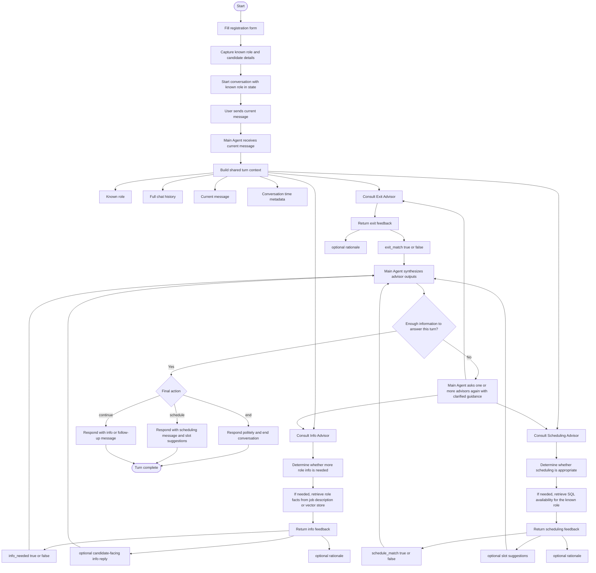

# One-Turn Conversation Flow

This file is the implementation reference for the assignment-aligned one-turn flow.

Key interpretation choices:
- The candidate starts from an intake/registration form before the chat begins.
- The role should be known at chat start, preferably from a dropdown or controlled input.
- The main agent orchestrates every turn.
- Advisors return structured feedback to the main agent.
- The main agent synthesizes advisor outputs into the final user-facing action and response.
- The main agent may consult one or more advisors again if the first pass is not sufficient.

## Expected Responsibilities

- Main Agent:
  - owns the turn loop
  - owns advisor orchestration
  - owns the final action decision
  - owns the final candidate-facing response
- Exit Advisor:
  - returns whether the conversation should end
- Info Advisor:
  - returns whether more role information is needed and the supporting reply content
- Scheduling Advisor:
  - returns whether it is time to schedule and the supporting slot suggestions

## Important Implementation Notes

- The role should not primarily be inferred from free text once the intake form exists.
- Advisors should consume shared context rather than maintain separate state models.
- SQL scheduling must be role-aware.
- Job-description facts should come from the PDF or the retrieval layer once added.
- The main agent should remain the only component that decides the final turn action shown to the user.
