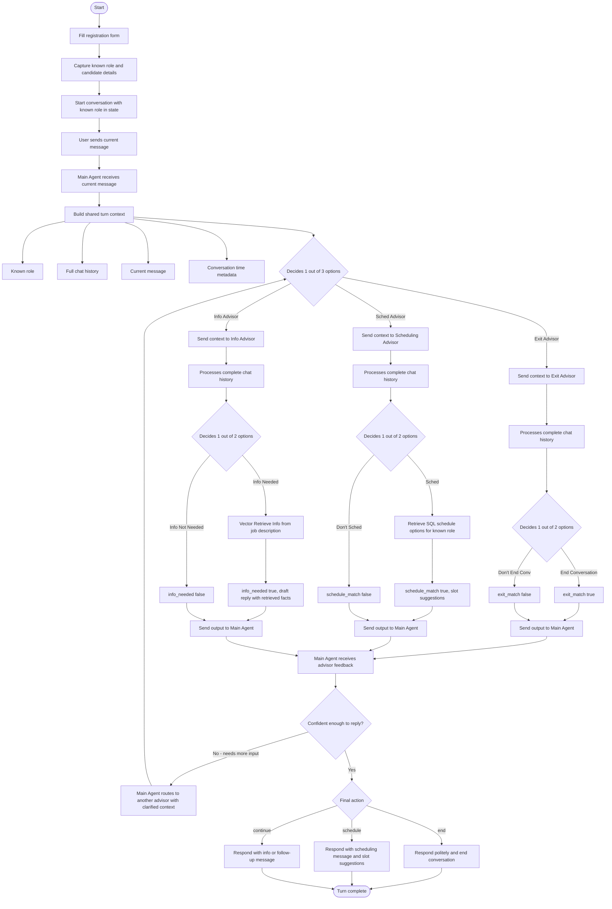

# One-Turn Conversation Flow

This file is the implementation reference for the assignment-aligned one-turn flow.

Key interpretation choices:
- The candidate starts from an intake/registration form before the chat begins.
- The role should be known at chat start, preferably from a dropdown or controlled input.
- The main agent orchestrates every turn.
- The main agent routes to exactly one advisor per pass, chosen based on the current message and context.
- The chosen advisor returns structured feedback to the main agent.
- If the main agent is not confident after the first advisor response, it can loop back and route to another advisor, passing additional context explaining why it needs more input.
- The main agent owns the final action and the final candidate-facing response.

## Expected Responsibilities

- Main Agent:
  - owns the turn loop
  - decides which one advisor to consult each pass
  - can loop back and consult another advisor if not confident, passing extra context
  - owns the final action decision (`continue`, `schedule`, or `end`)
  - owns the final candidate-facing response
- Exit Advisor:
  - receives message + history, decides `exit_match` true or false
- Scheduling Advisor:
  - receives message + history, decides `schedule_match` true or false
  - if schedule_match, retrieves available slots from SQL filtered by known role
- Info Advisor:
  - receives message + history, decides `info_needed` true or false
  - if info_needed, retrieves relevant facts from job description vector store
  - returns a draft candidate-facing reply

## Important Implementation Notes

- The role should not be inferred from free text; it comes from the intake form.
- Advisors consume shared context (message + history + role) rather than maintaining separate state.
- SQL scheduling must be role-aware using the normalized role value.
- Job-description facts should come from the PDF or the retrieval layer once added.
- The main agent is the only component that decides and sends the final turn reply to the candidate.
- The loopback pass should include a clarification note from the main agent explaining what additional input it needs.
